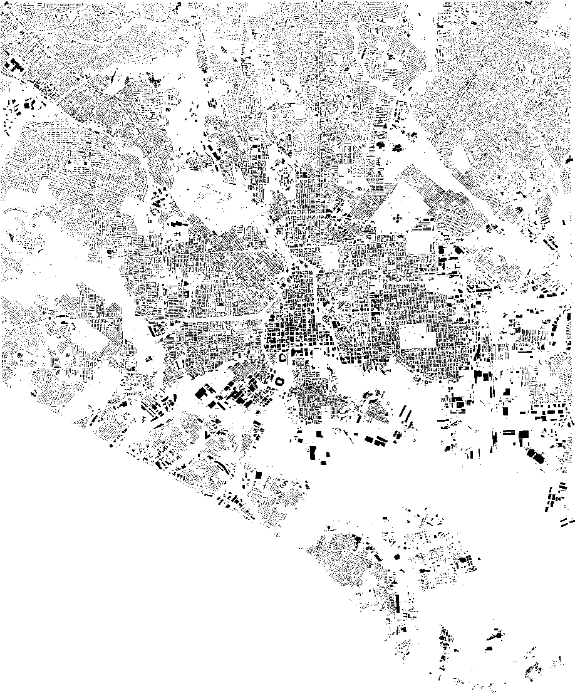

## Baltimore City OpenStreetMap Import

This repo will serve as a launching platform to get the data from the City of Baltimore into OpenStreetMap.

### Buildings & Addresses

The first working item is buildings and addresses. The city has released public domain buildings and addresses and city employees are collaborating on this process. The goal is the provide the OSM community and the general public with accurate addressing information, and building footprint context.

